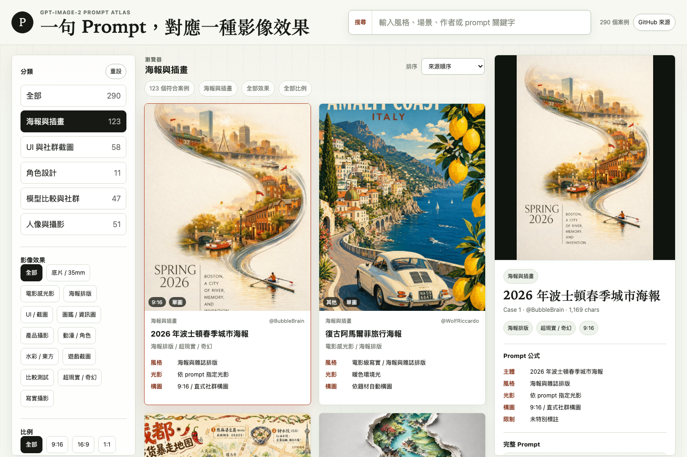
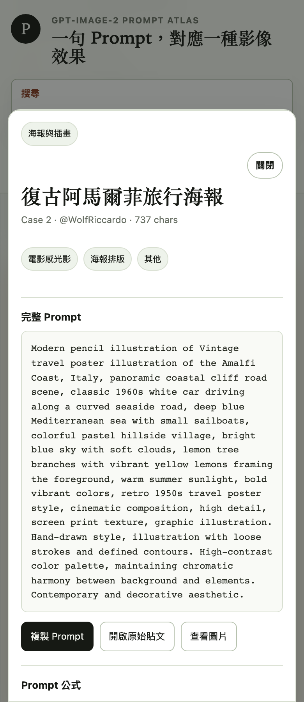

# GPT-Image-2 Prompt Atlas

一句 Prompt，對應一種影像效果。

This is a static visual browser for GPT-Image-2 prompt examples. It turns the prompt collection from `EvoLinkAI/awesome-gpt-image-2-prompts` into a searchable gallery, so you can quickly compare the prompt structure with the generated image result.

Live site: https://warrenlin.github.io/prompt-image-atlas/

## Screenshots

### Desktop



### Mobile Prompt Modal



## What It Does

- Browse 290 GPT-Image-2 prompt examples
- Compare output images and full prompts side by side
- Filter by category, image effect, and aspect ratio
- Search by title, author, prompt text, or visual style
- View an automatic prompt formula breakdown
- Copy the full prompt in one click
- Open full prompt details in a mobile-friendly modal
- Open the original source post and generated image

## Categories

- Portrait and photography
- Poster and illustration
- Character design
- UI and social media screenshots
- Model comparison and community experiments

## Data Source

The examples are extracted from:

- Source repo: https://github.com/EvoLinkAI/awesome-gpt-image-2-prompts
- Source file: `README_zh-TW.md`
- Snapshot commit: `6d229f7`
- Snapshot date: 2026-04-27
- Source license: CC BY 4.0

Images are loaded from GitHub raw URLs. The site needs network access to display them.

## Project Structure

```text
.
├── index.html
├── styles.css
├── app.js
├── assets/
│   ├── screenshot.png
│   └── mobile-screenshot.png
├── data/
│   └── cases.js
└── README.md
```

## Local Preview

Open `index.html` directly in a browser.

No build step is required. This is plain HTML, CSS, and JavaScript.

## Deployment

This project is deployed with GitHub Pages from the `main` branch root.

Public URL:

```text
https://warrenlin.github.io/prompt-image-atlas/
```

## Notes

This project is an independent browsing interface for studying prompt patterns. The original prompts, images, and source attribution belong to their respective creators and the upstream dataset.
